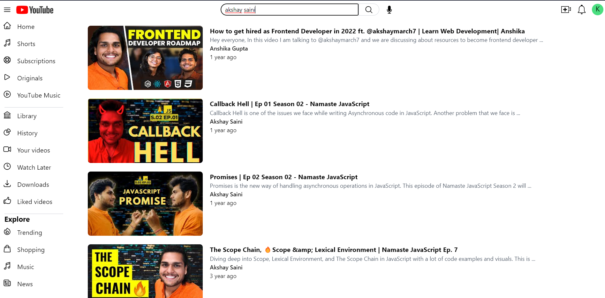

## YouTube 🎦

### How to Run this Project

```Bash
    git clone https://github.com/kritebh/react-youtube.git
    npm install
    touch .env #For Windows -> New-Item .env
```

Now in `.env` file we need YouTube API Key as following :

```javascript
    REACT_APP_YT_KEY = "Your YouTube API Key"
```

After this just start the server by running the following command

```Bash
   npm start
```

### How to get YouTube API Key 🗝️

Just go to this page and follow the guide

[Google Developers Docs](https://developers.google.com/youtube/v3/getting-started)


## Features ✨✨
- Search Features (with Debouncing and Cache)
- Watch Page, Search Page (With Routing)
- N-level nested Comments
- Live Chat (with Dummy API Polling)

## Screenshots

### Homepage


### Search Page



### Watch Page


### Nested Comment


### Live Chat


### Search AutoSuggestion


*Not optimized for smaller screen